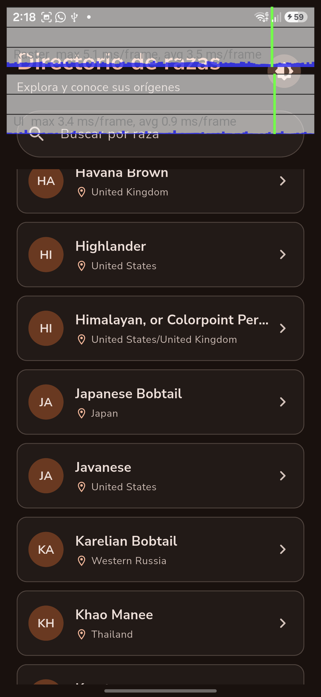
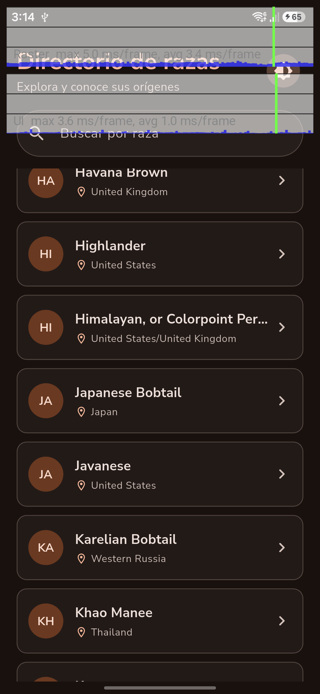

<p align="center">
  
</p>

<p align="center">
  Directorio de razas de gatos desarrollado en Flutter para la prueba técnica de
  <strong>Nextep Innovation</strong>.
</p>

## Descripción

Cat-tionary consume la API pública [Cat Facts](https://catfact.ninja/) para explorar
razas de gatos, consultar sus datos completos y mostrar un dato curioso aleatorio.
La aplicación prioriza una experiencia fluida ante conexiones lentas o intermitentes:
mantiene el catálogo ya cargado, reintenta fallos transitorios y puede iniciar con la
última copia local disponible.

El nombre visible de la aplicación es **Cat-tionary**. El repositorio conserva el
nombre solicitado `cat-directory-app` y el paquete Dart es `cat_directory_app`.

## Descargar APK

[Descargar Cat-tionary v1.0.0 para Android](https://github.com/Jhonnysour/cat-directory-app/releases/download/v1.0.0/app-release.apk)
o consultar las [notas del release](https://github.com/Jhonnysour/cat-directory-app/releases/tag/v1.0.0).

Compatible con **Android 7.0 o superior, arquitectura ARM64**. Tamaño aproximado:
**20,7 MB**. Descarga `app-release.apk` en el teléfono y ábrelo para instalarlo;
si Android lo solicita, autoriza la instalación desde esa fuente de confianza.
Es una compilación release con firma de desarrollo para evaluación, no para tiendas.

## Funcionalidades

- Directorio paginado mediante infinite scroll.
- Control de concurrencia para impedir solicitudes de página duplicadas.
- Pull-to-refresh desde la primera página.
- Búsqueda local con debounce de 300 ms sobre el catálogo cargado en memoria.
- Caché acumulativa con TTL de una hora y estrategia stale-while-revalidate.
- Inicio offline mostrando inmediatamente la última copia guardada.
- Preservación de la lista cuando falla una página posterior.
- Reintentos automáticos con backoff exponencial para errores transitorios.
- Ruta parametrizada `/breed/:name` mediante GoRouter.
- Resolución de deep links en frío desde caché o recorriendo la API.
- Detalle con raza, país, origen, pelaje y patrón.
- Animación Hero del monograma entre el directorio y el detalle, en ambos sentidos.
- Dato curioso aleatorio con carga y error independientes del detalle.
- Temas Material 3: Sistema, Claro y Oscuro, con preferencia persistente.
- Semántica accesible para buscador, tarjetas, carga, vacío y errores.
- Identidad nativa con ícono adaptativo y splash claro/oscuro.

## Stack

| Área | Tecnología |
|---|---|
| Framework | Flutter 3.44.8 / Dart 3.12.2 |
| Estado | `flutter_bloc`, `bloc_concurrency`, `stream_transform` |
| Red | `dio` |
| Modelos | `freezed`, `json_serializable` |
| Rutas | `go_router` |
| Persistencia | `shared_preferences` |
| Conectividad | `connectivity_plus` |
| Pruebas | `flutter_test`, `bloc_test`, `mocktail` |

## Requisitos

- Flutter estable compatible con Dart `^3.12.2`.
- Android Studio o un SDK de Android configurado.
- Un emulador o dispositivo Android con depuración habilitada.
- Conexión a internet para obtener información nueva de la API.

Comprueba el entorno con:

```bash
flutter doctor
```

## Ejecución

```bash
git clone https://github.com/Jhonnysour/cat-directory-app.git
cd cat-directory-app
flutter pub get
flutter run
```

Si hay varios dispositivos disponibles:

```bash
flutter devices
flutter run -d <device-id>
```

Los archivos generados por Freezed y JSON Serializable ya forman parte del
repositorio. Si se modifican los modelos:

```bash
dart run build_runner build --delete-conflicting-outputs
```

### Verificaciones

```bash
flutter analyze
flutter test
```

Última verificación: **análisis estático limpio y 188 pruebas aprobadas**
(164 unitarias y 24 de widgets).

Para medir la cobertura y resumir las líneas del código de la app, excluyendo
archivos generados:

```bash
flutter test --coverage
dart run tool/coverage_summary.dart
```

El informe local se genera en `coverage/lcov.info` y no se incluye en Git.

### APK release

Para generar un APK ARM64 como el publicado:

```bash
flutter build apk --release --target-platform android-arm64
```

El archivo se genera en:

```text
build/app/outputs/flutter-apk/app-release.apk
```

La configuración actual usa la firma de debug para que el APK release pueda
instalarse durante la evaluación. No debe utilizarse así para publicar en una tienda.

El permiso `android.permission.INTERNET` se declara en el manifiesto principal,
para que las peticiones funcionen también en release, no solo en debug/profile.
Se comprobó su presencia en el APK y el acceso real a `/breeds` y `/fact` desde
el teléfono físico con la compilación release instalada.

## Arquitectura

Se utiliza una arquitectura **feature-first** con tres capas. La interfaz depende de
abstracciones del dominio y no conoce Dio, JSON ni los modelos de persistencia.

```text
lib/
├── core/
│   ├── error/       # Fallos tipados con Freezed
│   ├── network/     # Dio, conectividad y retry con backoff
│   ├── router/      # GoRouter y rutas parametrizadas
│   └── theme/       # Material 3 y preferencia de apariencia
└── features/
    └── breeds/
        ├── data/
        │   ├── datasources/   # API y caché local
        │   ├── models/        # DTO fuertemente tipados
        │   └── repositories/  # Implementación offline-first
        ├── domain/
        │   ├── entities/      # Entidades puras
        │   └── repositories/  # Contrato de datos
        └── presentation/
            ├── bloc/          # Listado y detalle
            ├── pages/
            └── widgets/
```

Flujo principal de dependencias:

```text
Widgets → BLoC → Repositorio abstracto → Implementación → API / caché
                    ↑
                 Dominio
```

No se añadió una capa de casos de uso: con dos endpoints, el repositorio abstracto
ya proporciona inversión de dependencias y reglas de acceso claras. Una capa extra
añadiría ceremonia sin aislar ninguna complejidad adicional.

## ¿Por qué BLoC?

El enunciado exige control explícito de eventos asíncronos. BLoC permite expresar
esa política cerca de cada evento:

- `droppable()` descarta solicitudes de paginación mientras otra sigue activa.
- `restartable()` mantiene vigentes solo el arranque o refresh más reciente.
- `debounce(300 ms) + switchMap` evita búsquedas fuera de orden.
- El estado distingue carga inicial, refresh, revalidación y paginación, por lo que
  un fallo posterior no borra datos útiles.

Se prefirió esta solución sobre Riverpod porque `bloc_concurrency` y
`stream_transform` hacen visible y verificable la transformación solicitada, sin
implementar cancelación manual.

## Red, errores y funcionamiento offline

### Reintentos

`RetryInterceptor` reintenta únicamente operaciones idempotentes (`GET` y `HEAD`)
ante timeouts, errores de conexión y respuestas `408`, `429`, `500`, `502`, `503` o
`504`. El límite es de tres reintentos con esperas exponenciales de 500 ms, 1 s y
2 s. Después, el error
se convierte en un `Failure` tipado para que la presentación no reciba excepciones
de Dio.

### Caché stale-while-revalidate

`shared_preferences` guarda un snapshot versionado del catálogo acumulado, su
timestamp y metadatos de paginación. El catálogo ronda las 98 razas, por lo que el
JSON permanece pequeño y no justifica añadir Hive, Isar o SQLite.

- TTL: una hora.
- Caché vigente: se muestra inmediatamente sin una petición innecesaria.
- Caché vencida: se muestra como stale y se revalida en segundo plano.
- Sin conexión: se conserva la copia local y aparece un banner explícito.
- Fallo de una página posterior: las tarjetas existentes permanecen visibles.

El repositorio también protege la persistencia frente a respuestas fuera de orden:
una revisión identifica la generación vigente del catálogo y una cola serializa
los reemplazos y las operaciones de lectura/mezcla/escritura. Así, una página,
revalidación o búsqueda anterior no sobrescribe la caché de un refresh más reciente.
Las respuestas pueden seguir llegando a sus consumidores; no se cancela HTTP y
el BLoC mantiene su propio control de vigencia de la UI. La coordinación vive en
la instancia compartida del repositorio y los errores de almacenamiento siguen
siendo secundarios a entregar los datos de red.

Tras un fallo de paginación, la carga automática queda pausada para evitar una
ráfaga de peticiones y Snackbars al volver al final. Se reactiva mediante
`Reintentar`, pull-to-refresh o al detectar que regresó la conexión.

El Snackbar dura cinco segundos normalmente. Con navegación accesible activa se
mantiene visible para que la acción `Reintentar` no desaparezca antes de poder
alcanzarla.

## Navegación y detalle

La ruta `/breed/:name` es una ruta superior independiente. Al navegar desde el
directorio se envía la entidad mediante `GoRouter.extra`, lo que permite pintar el
detalle inmediatamente. La URL sigue siendo autosuficiente: en un arranque en frío,
el repositorio busca primero en caché y después pagina la API hasta encontrar la
raza, completar el catálogo o recibir un fallo real.

Cat Facts no ofrece un endpoint de detalle de raza. Los cinco campos ya llegan en
`/breeds`; por eso el detalle solo llama a `/fact`.

El endpoint `/fact` tampoco acepta el nombre ni un identificador de raza. Su respuesta
es un dato general aleatorio sobre gatos, no un dato asociado a la raza seleccionada.
La interfaz lo comunica como **Dato curioso aleatorio** y mantiene su carga o error
en un subestado independiente para no ocultar la información principal.

### Transición Hero

El monograma comparte un `Hero` entre la tarjeta y el encabezado del detalle.
`BreedAvatar` interpola su tamaño, color y tipografía tanto al entrar como al volver.
El tag usa el nombre completo normalizado, no las iniciales, para distinguir razas
que comparten monograma. El detalle muestra la entidad recibida desde el primer
frame, sin esperar al evento del BLoC ni al dato curioso.

Las rutas devuelven `MaterialPage` de Flutter explícitamente: con la versión actual
de GoRouter, la detección automática del tipo de aplicación podía elegir una
página sin transición. Las pruebas verifican el vuelo real en el overlay, no solo
que exista un widget `Hero`. Un deep link en frío no necesita tarjeta de origen;
el monograma sigue siendo decorativo para TalkBack y su vuelo se desactiva cuando
el sistema solicita reducir animaciones. No se añaden dependencias.

## Búsqueda

La búsqueda filtra únicamente las razas ya cargadas en memoria, tal como solicita
la prueba. Mientras hay una consulta activa no se solicitan páginas adicionales.
Esto evita que el resultado cambie por actividad de red inesperada y mantiene el
debounce totalmente local.

## Temas y accesibilidad

`AppTheme` genera los esquemas claro y oscuro desde el mismo seed terracota
`#9A4F2C`. `ThemeController` mantiene una preferencia global con tres opciones:

- **Sistema**, valor inicial.
- **Claro**.
- **Oscuro**.

Los overrides se guardan en `shared_preferences`. Nunito Sans se incluye localmente
solo en pesos 400, 600 y 700 bajo licencia OFL; así no existe una descarga de fuentes
en runtime y su impacto puede medirse en el APK.

El encabezado usa **Cat-tionary** en Great Vibes Regular, la misma fuente del splash,
con **Tu directorio de razas** debajo en Nunito Sans. Se conserva el subtítulo
«Explora y conoce más sobre tus gatos favoritos». Solo la marca usa cursiva; el
resto mantiene la tipografía de lectura. Great Vibes se empaqueta localmente para
funcionar offline y el título completo se anuncia como un único encabezado accesible.

Las tarjetas y estados visuales usan `ExcludeSemantics` detrás de una etiqueta única
para evitar lecturas duplicadas. Los botones, campos editables y áreas desplazables
conservan sus acciones nativas. La validación se realizó con TalkBack en un teléfono
físico, con el árbol accesible de Android y mediante widget tests.

En las tarjetas, la acción `onTap` se expone explícitamente en el `Semantics`
exterior: excluir los textos decorativos no debe ocultar también la acción de abrir
el detalle. Las pruebas despachan `SemanticsAction.tap`, no solo toques de pantalla,
y verifican navegación, activación única y ausencia de acción si no hay callback.
En el Samsung con el APK release corregido se confirmó que la tarjeta expone
`clickable: true` en el árbol accesible de Android (antes figuraba `false`). Esta
comprobación y las acciones semánticas automatizadas no se presentan como una
nueva evaluación manual completa con TalkBack.

## Identidad de Cat-tionary

Los recursos del ícono adaptativo, ícono iOS y splash derivan de una sola ilustración
PNG. La silueta se escaló para respetar las máscaras de cada plataforma y evitar
recortes de orejas o cola. El ícono no contiene el nombre completo: a unos 48 dp la
caligrafía sería ilegible y el sistema ya muestra el nombre de la app debajo.

El splash es nativo y no añade una pantalla Flutter intermedia. Android 12+ limita
su composición a un ícono centrado y branding inferior, por eso el texto
“Cat-tionary” aparece abajo. Se añadieron intencionalmente **500 ms para que el usuario
pueda apreciar la ilustración y la identidad de Cat-tionary en el splash**. Esta
espera empieza cuando se construye el primer frame de la app y se implementa con
`deferFirstFrame`/`allowFirstFrame`. La caché y las peticiones pueden prepararse
durante esa espera; no se bloquea el hilo ni se espera a la red para retirarlo.
Es un coste deliberado de medio segundo en la presentación inicial, no una pausa
al regresar desde segundo plano. No se añade otra pantalla ni una dependencia.

Los fondos son crema `#F6EDE3` en claro y `#1A110E` en oscuro. El splash sigue el
tema del **sistema**, porque se dibuja antes de que Dart pueda leer la preferencia de
la app. Si el usuario fuerza un tema contrario, puede existir una transición breve
al primer frame Flutter. Se aceptó este trade-off para no añadir código nativo al
MVP; `UiModeManager.setApplicationNightMode()` queda como mejora opcional en Android
12+, mientras que iOS no ofrece un equivalente para su launch screen.

`flutter_launcher_icons` y `flutter_native_splash` son dependencias exclusivas de
desarrollo: generan recursos nativos, pero no añaden código ni dependencias en
runtime. La marca se integró antes de medir el tamaño para que la auditoría represente
el binario final.

## Auditoría de rendimiento

### Scroll

| Campo | Resultado |
|---|---|
| Dispositivo | Samsung SM-A566E físico, conectado por USB |
| Sistema | Android 16 (API 36), ARM64 |
| Pantalla | 1080 × 2340; 60 Hz activos, comprobados con `dumpsys display` |
| Build | Profile, Flutter 3.44.8; tema oscuro |
| Renderizador | Impeller sobre Vulkan |
| Fecha | 23 de septiembre de 2026 |
| Escenario | 98 razas cargadas antes de medir, verificadas con el árbol accesible; última raza “York Chocolate” |

La medición inicial, anterior a integrar Hero, incluyó dos pasadas partiendo del
final del catálogo: 18 gestos hacia el inicio
y 18 de vuelta hacia el final. Cada gesto ADB duró 650 ms, con una pausa de 250 ms
entre gestos, sin interacción manual. La carga de páginas y el arranque quedaron
fuera de la medición. El PerformanceOverlay estuvo activo; en la segunda pasada se
activó además la traza de Dart/Embedder/GC para investigar los frames lentos.



La captura se tomó durante un gesto de la primera pasada. El overlay representa
los últimos 300 frames de cada hilo, **no todo el recorrido**. Por eso se guardaron
también los eventos `Flutter.Frame` del servicio de la VM durante ambas ventanas:

| Medición | Pasada 1 | Pasada 2 |
|---|---:|---:|
| Duración | 37,829 s | 37,651 s |
| Frames registrados | 2.074 | 2.087 |
| UI: promedio / p95 / máximo | 0,94 / 2,61 / 12,12 ms | 0,93 / 2,58 / 6,19 ms |
| Raster: promedio / p95 / máximo | 3,91 / 4,75 / 20,79 ms | 3,91 / 4,72 / 23,37 ms |
| Frames con UI o raster > 16,67 ms | 1 | 1 |

Registros completos: [pasada 1](assets/readme/performance_phone.json) y
[pasada 2](assets/readme/performance_phone_repeat.json). Los tiempos originales
están en microsegundos; los resúmenes, en milisegundos. Se compara cada etapa por
separado con el presupuesto de 60 Hz; no se suman UI y raster para contar jank.

**Resultado:** 2 de 4.161 frames (aproximadamente 0,048 %) excedieron el presupuesto,
ambos en rasterización. No se detectó lentitud sostenida, pero no se afirma “cero
jank”. En el frame 5433 de la segunda pasada, la traza muestra
`Canvas::saveLayer` durante 20,38 ms dentro de `SurfaceFrame::Encode`; la UI tardó
1,47 ms y `SceneDisplayLag` registró una transición de vsync perdida. Esto localiza
el pico en el procesamiento gráfico de una capa, no en el trabajo de UI de ese
frame. La traza no permite adjudicar con certeza el coste a un widget concreto,
al driver o a planificación del sistema. El pico de la primera pasada se conserva
sin atribuirle esa misma causa, porque no se capturó su traza detallada.

Se incluye un [extracto de 120 ms alrededor del frame lento](assets/readme/performance_phone_slow_frame.json)
en formato Chrome Trace Event (no es un snapshot de DevTools). La traza circular
completa de la segunda pasada retuvo unos 5,96 s finales; los registros
`Flutter.Frame` sí cubren ambas ventanas completas. Estos resultados corresponden
a este dispositivo, frecuencia y escenario; no garantizan el mismo rendimiento en
otros equipos ni miden la presentación final de todos los frames del compositor
de Android.

Para repetir la comprobación:

1. Conectar un teléfono físico y ejecutar `flutter run --profile -d <device-id>`.
2. Cargar las 98 razas y dejar el buscador vacío.
3. Activar el overlay con `P` en la terminal, o grabar en Performance de DevTools.
4. Desplazar la lista en ambos sentidos y capturar mientras está en movimiento.
5. Registrar la frecuencia activa y revisar UI y raster, incluidos los picos.

Se sigue la [guía de rendimiento de Flutter](https://docs.flutter.dev/perf/ui-performance)
y la interpretación de [FrameTiming](https://api.flutter.dev/flutter/dart-ui/FrameTiming-class.html).
La prueba previa en emulador queda sustituida por esta evidencia física; no se
usa para concluir el rendimiento de un teléfono real.

La lista usa `ListView.builder` para construir bajo demanda los elementos visibles
y los cercanos dentro de su área de caché. Las tarjetas muestran monogramas locales:
no descargan ni decodifican imágenes remotas por celda. El scroll medido se hizo
con el catálogo ya cargado, separando el coste de renderizado del de paginación.

### Comprobación de scroll con Hero integrado

Se repitió el recorrido en la versión con `BreedAvatar` y rutas Material explícitas,
en el mismo Samsung, profile, tema oscuro y 60 Hz. Se verificaron 98 razas antes y
después, sin cambiar el escenario de 36 gestos ni incluir descarga de páginas.
El overlay y la traza Dart/Embedder/GC estuvieron activos.
Esta captura precede a los ajustes posteriores de encabezado, subtítulo y a los
500 ms extra de splash. El arranque no formaba parte de la medición; estos ajustes
no cuentan con una nueva pasada de scroll y no se les atribuyen cifras no medidas.



| Medición | Resultado |
|---|---:|
| Duración | 37,852 s |
| Frames registrados | 2.080 |
| UI: promedio / p95 / máximo | 0,96 / 2,71 / 7,00 ms |
| Raster: promedio / p95 / máximo | 3,88 / 4,74 / 24,67 ms |
| Frames con UI o raster > 16,67 ms | 1 (0,048 %) |

El [registro completo](assets/readme/performance_phone_hero.json) conserva el pico
de rasterizado. No se observó lentitud sostenida en esta ventana; no equivale a
ausencia de jank ni a una medición del vuelo Hero, porque el escenario fue scroll.
La captura del overlay se tomó durante un gesto y no incluye necesariamente el
pico ocurrido fuera de sus últimos 300 frames.

El [extracto de traza del frame 3345](assets/readme/performance_phone_hero_slow_frame.json)
localiza el pico en raster: `SurfaceFrame::Encode` tardó 23,729 ms e incluyó
`Canvas::saveLayer` durante 21,685 ms; la UI del frame tardó 1,097 ms. Son spans
anidados y no deben sumarse. La traza sitúa el retraso durante el procesamiento de
una capa, pero no identifica su widget ni determina si la causa raíz fue GPU,
driver o planificación del sistema. No se atribuye el pico al vuelo Hero, que no
formaba parte del escenario medido.

### Tamaño del APK

`--analyze-size` requiere una única ABI, por lo que se auditó el APK ARM64 final,
regenerado con el permiso de internet, Hero, el encabezado con Great Vibes, el
subtítulo, la espera del splash y las correcciones de accesibilidad y caché:

```bash
flutter build apk --release --analyze-size --target-platform android-arm64
```

| Componente comprimido | Tamaño aproximado |
|---|---:|
| APK release | 20,7 MB (21.656.853 bytes) |
| Bibliotecas nativas `arm64-v8a` | 16 MB |
| Assets Flutter | 536 KB |
| `classes.dex` | 369 KB |
| `resources.arsc` | 104 KB |

Los símbolos AOT representan aproximadamente 5 MB descomprimidos. Dentro de ellos,
Flutter aporta cerca de 2 MB, `material_ui` 120 KB, el código de Cat-tionary 96 KB,
GoRouter 74 KB y Dio 46 KB. Los recursos PNG más grandes pertenecen al ícono y al
splash final; ese incremento es esperado y motivó integrar el branding antes de
esta medición.

El tree shaking redujo `CupertinoIcons.ttf` de 257.628 a 848 bytes y
`MaterialIcons-Regular.otf` de 1.645.184 a 4.216 bytes: una reducción del 99,7 % en
ambos casos. Nunito Sans permanece porque sus tres pesos se usan explícitamente.
Great Vibes se empaqueta solo en peso regular para el nombre del directorio. Con
esta fuente local y las licencias incluidas, el APK creció 221.538 bytes respecto
a la compilación anterior; no requiere descargar tipografías durante el uso.

## Pruebas cubiertas

Las pruebas unitarias se organizan en `test/core/` y `test/features/`, con fixtures,
mocks y un adaptador HTTP simulado en `test/support/`. No requieren internet,
teléfono ni emulador; no se añaden dependencias. Se ejercita el pipeline real de
Dio con respuestas controladas, se inyecta el reloj de la caché y se registran las
esperas del retry sin esperar el backoff real. Las pruebas de concurrencia retienen
respuestas con `Completer` para controlar explícitamente el orden de llegada.

| Área | Comportamientos verificados |
|---|---|
| BLoC del directorio | Carga, caché stale, paginación concurrente, deduplicación, fin de catálogo, errores sin pérdida de datos, reintento, refresh, respuestas antiguas y debounce |
| BLoC del detalle | Datos recibidos o resolución en frío, no encontrado frente a error, loading independiente del dato, reintento y solicitudes concurrentes o tardías |
| Repositorio | Caché offline sin HTTP, revalidación, persistencia acumulada, respuestas obsoletas, escrituras concurrentes, fallos de almacenamiento, búsqueda paginada por nombre y conversión de errores |
| Caché local | Serialización, versión, TTL y su frontera, snapshot corrupto, eliminación selectiva y errores de almacenamiento |
| Red | Configuración de Dio, backoff y límite, códigos transitorios, métodos permitidos, cancelación y cambios de conectividad sin duplicados |
| Datos y tema | Contrato de endpoints y modelos, entidades inmutables, tema predeterminado, restauración y fallos de preferencias |

La cobertura de líneas instrumentadas del código no generado es **91,44 %
(1.004/1.098)** al ejecutar la suite completa. Ambos BLoC, el repositorio y la caché
local alcanzan el 100 % de sus líneas instrumentadas; el interceptor de retry,
el 95 %. Son métricas de líneas, no de ramas ni una garantía de ausencia de fallos.
La suite no reemplaza las pruebas manuales de TalkBack, rendimiento o integración
con los servicios nativos y la API real.

Las 9 pruebas de widgets en `test/widget_test.dart` validan:

- Renderizado del directorio.
- Etiquetas semánticas, búsqueda con debounce y limpieza.
- Fuente Nunito Sans y respuesta al tema del sistema.
- Override manual de tema.
- Navegación al detalle y carga independiente del dato curioso.
- Resolución de deep link en frío.
- Diferencia entre raza inexistente y fallo de red durante la resolución.
- Expiración del Snackbar sin pérdida de las razas cargadas.

Las 8 pruebas adicionales en `test/hero_test.dart` comprueban el vuelo de ida y
vuelta en claro/oscuro, conservación del filtro, tags únicos para monogramas
iguales, deep link en frío, carga independiente del dato durante la animación,
movimiento reducido y ausencia de etiquetas semánticas duplicadas en el overlay.

`test/startup_test.dart` verifica que se retiene el primer frame durante 500 ms,
que el trabajo asíncrono continúa durante esa espera y que volver desde segundo
plano no repite el retraso. El directorio también se comprueba a 320 px de ancho
para detectar desbordamientos con el subtítulo completo.

Las 3 pruebas de `test/accessibility_test.dart` comprueban las acciones semánticas
de las tarjetas, incluyendo apertura del detalle y retorno por acción accesible.
Las 10 regresiones de concurrencia adicionales del repositorio controlan con
`Completer` la llegada de respuestas, lecturas y escrituras antiguas, además de la
recuperación de la cola después de un fallo de persistencia.

Las 3 pruebas de `test/directory_brand_test.dart` cargan las fuentes reales para
comprobar la tipografía de marca, el encabezado a 320 px con texto al 200 % y la
semántica agrupada con el selector de tema independiente. El caso de texto ampliado
aísla el encabezado con un catálogo vacío; no equivale a auditar toda la app a esa escala.

## Limitaciones y mejoras opcionales

- Traducir al español los valores externos y datos curiosos mediante una estrategia
  cacheable y medible.
- Sincronizar en Android 12+ el splash con el override de tema de la app.
- Configurar App Links/Universal Links con un dominio verificado.

## Licencias de recursos

- Nunito Sans se distribuye bajo SIL Open Font License; se incluye su archivo
  `assets/fonts/OFL.txt`.
- Great Vibes se distribuye bajo [SIL Open Font License 1.1](https://raw.githubusercontent.com/google/fonts/main/ofl/greatvibes/OFL.txt);
  se incluye `assets/fonts/GreatVibes-OFL.txt`. Ambas licencias se empaquetan como assets.
- La ilustración de Cat-tionary fue creada específicamente para este proyecto.
